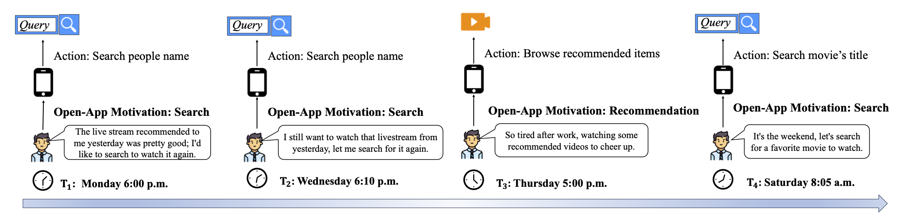
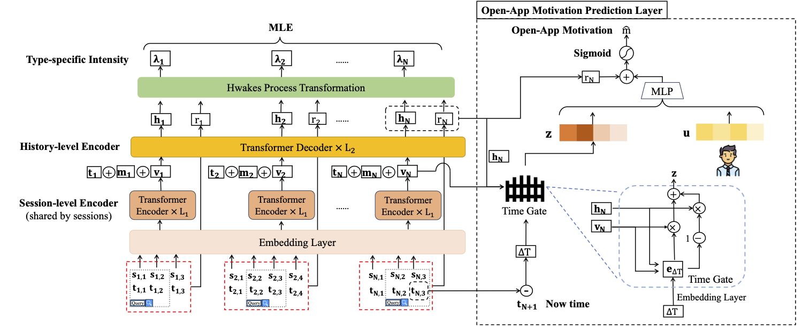
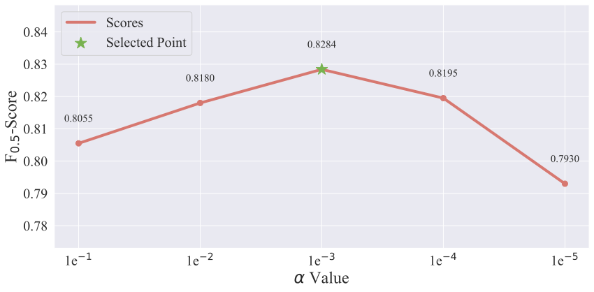

# NHP_OAM
The implementation of the paper: "To Search or to Recommend: Predicting Open-App Motivation with the Deep Hawkes Process"

Incorporating Search and Recommendation (S&R) services within a singular application is prevalent in online platforms, leading to a new task termed open-app motivation prediction, which aims to predict whether users initiate the application with the specific intent of information searching, or to explore recommended content for entertainment. Studies have shown that predicting users' motivation to open an app can help to improve user engagement and enhance performance in various downstream tasks. However, accurately predicting open-app motivation is not trivial, as it is influenced by user-specific factors, search queries, clicked items, as well as their temporal occurrences. Furthermore, these activities occur sequentially and exhibit intricate temporal dependencies. Inspired by the success of the Neural Hawkes Process (NHP) in modeling temporal dependencies in sequences, this paper proposes a novel neural Hawkes process model to capture the temporal dependencies between historical user browsing and querying actions. The model, referred to as Neural Hawkes Process-based Open-App Motivation prediction model (NHP-OAM), employs a hierarchical transformer and a novel intensity function to encode multiple factors, and open-app motivation prediction layer to integrate time and user-specific information for predicting users' open-app motivations. To demonstrate the superiority of our NHP-OAM model and construct a benchmark for the Open-App Motivation Prediction task, we not only extend the public S\&R dataset ZhihuRec but also construct a new real-world Open-App Motivation Dataset (OAMD). Experiments on these two datasets validate NHP-OAM's superiority over baseline models. Further downstream application experiments demonstrate NHP-OAM's effectiveness in predicting users' Open-App Motivation, highlighting the immense application value of NHP-OAM.






# Dataset

Unzip the below datasets and put them in the corresponding folder.

The OAMD can be downloaded from [OAMD](https://drive.google.com/file/d/1de956E9UCrvamz3hyQpaOqWkvdUpMLu3/view?usp=drive_link).

The extended ZhihuRec can be downloaded from  [ZhihuRec](https://drive.google.com/file/d/1GIRgLYPfcMeIAjnQ7F9I-ZsQP3GfBcuS/view?usp=drive_link).

# Trainining and Evaluation
```python
python ./NHP_OAM_OAMD/main_NHP_OAM.py
python ./NHP_OAM_ZhihuRec/main_NHP_OAM.py
```
The parameters used in the above code are shown in their own files as default parameters.

## Impact of 𝛼 


Since the loss function is composed of two parts with different magnitudes of loss, we use 𝛼 to control the impact of the two parts of loss on parameter learning. To investigate the impacts of the hyper-parameter, we conducted experiments with varying 𝛼. From the results in the above figure, we found that the performance peaks when 𝛼 is 1×10^{-3}. With a further increase in hyperparameters, the performances become worse. We attribute this to the fact that the log-likelihood loss has larger values compared to the cross-entropy loss. Using 𝛼 of 1×10^{-3} allows us to control the optimization ratio of both. However, it also can't be too small, otherwise, it will result in a decline in optimization effectiveness.


# Check training and evaluation process
### Requirements
```
torch>=1.9.1+cu111
transformers>=4.18.0
numpy>=1.20.1
jieba>=0.42.1
six>=1.15.0
rouge>=1.0.1
tqdm>=4.59.0
scikit-learn>=0.24.1
pandas>=1.2.4
matplotlib>=3.3.4
termcolor>=1.1.0
networkx>=2.5
requests>=2.25.1
filelock>=3.0.12
gensim>=3.8.3
scipy>=1.6.2
seaborn>=0.11.1
boto3>=1.26.18
botocore>=1.29.18
pip>=22.0.3
packaging>=20.9
Pillow>=8.2.0
ipython>=7.22.0
regex>=2021.4.4
tokenizers>=0.12.1
PyYAML>=5.4.1
sacremoses>=0.0.53
psutil>=5.8.0
h5py>=2.10.0
msgpack>=1.0.2
setproctitle==1.3.2
```
